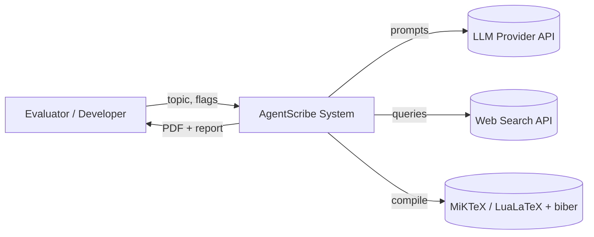
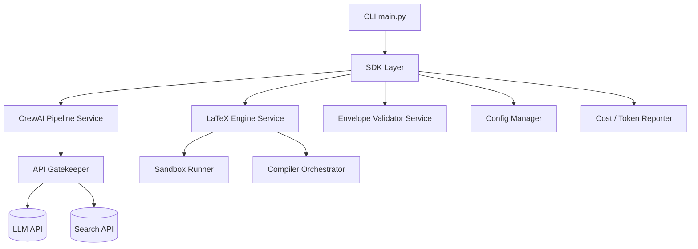
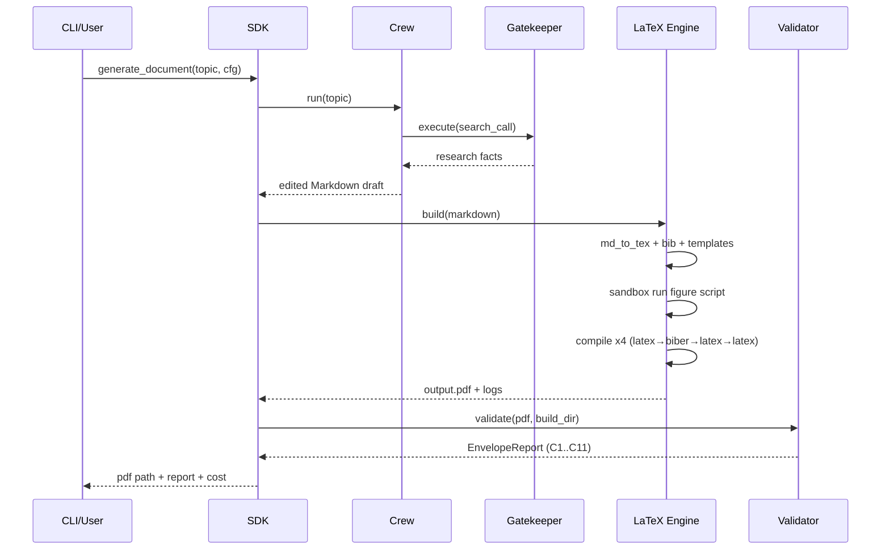

# PLAN — AgentScribe Architecture & Technical Design

**Companion to:** [`PRD.md`](PRD.md) · [`TODO.md`](TODO.md)
**Version:** 1.00 · **Last updated:** 2026-06-03 · **Status:** Draft

This document describes the architecture (C4 model), key design decisions (ADRs), data schemas, and the SDK/interface contracts for AgentScribe.

---

## 1. Architectural Overview

AgentScribe is a layered, SDK-fronted pipeline. External consumers (CLI today; GUI/REST later) talk **only** to the SDK. The SDK orchestrates domain services (the CrewAI crew, the LaTeX engine, the validator). All outbound API calls funnel through a single **API gatekeeper**. All generated code executes in a **sandbox**.

```
External Consumers (CLI now; GUI/REST later)
        |
        v
   +---------+
   |   SDK   |   single entry point: generate_document(), research(), compile(), validate()
   +----+----+
        |
        v
   +-----------------------------+
   |        Domain Services      |
   |  crew/  latex/  validate/   |
   +----+------------------+-----+
        |                  |
        v                  v
   +-----------+     +--------------+
   | Gatekeeper|     |   Sandbox    |
   | (rate lim)|     | (run Python) |
   +-----+-----+     +------+-------+
         |                  |
         v                  v
   LLM API / Search     MiKTeX (LuaLaTeX, biber)
```

---

## 2. C4 Model

### 2.1 Level 1 — System Context


### 2.2 Level 2 — Containers


### 2.3 Level 3 — Components (key modules)
- `sdk/sdk.py` — `AgentScribeSDK` facade.
- `services/crew/` — `agents.py` (factory), `tasks.py`, `pipeline.py` (Crew assembly + `kickoff`).
- `services/latex/` — `md_to_tex.py`, `templates.py` (cover/TOC/headers/TikZ), `figures.py` (Python chart gen), `compiler.py` (multi-pass), `bibliography.py`.
- `services/validate/` — `envelope.py` (C1–C11 checks), `report.py`.
- `shared/` — `gatekeeper.py`, `config.py`, `version.py`, `sandbox.py`, `cost.py`, `logging_setup.py`.
- `constants.py` — enums, defaults, fixed strings.

### 2.4 Level 4 — Code (primary contracts)
See §5 (SDK contract) and §6 (data schemas).

---

## 3. Pipeline Sequence



---

## 4. Architecture Decision Records (ADRs)

### ADR-001 — Orchestrate with CrewAI (not raw LangChain / LangGraph)
**Decision:** Use CrewAI for the agent crew.
**Rationale:** The task is a role-based, organization-like workflow (researcher/writer/editor/LaTeX engineer) with sequential context passing — exactly CrewAI's model. LangChain suits linear pipes; LangGraph suits branching state machines. The assignment explicitly targets CrewAI.
**Trade-offs:** Less fine-grained control than LangGraph's state machine; acceptable because our flow is mostly sequential with one optional human checkpoint.
**Alternatives considered:** LangGraph (overkill for a near-linear flow), bare LLM calls (not repeatable / not a system).

### ADR-002 — Markdown-first, then LaTeX
**Decision:** Agents produce Markdown; a dedicated LaTeX agent/service converts to `.tex`.
**Rationale:** Markdown is fast to generate and review; defer LaTeX fragility until content is final (per assignment §13.2).
**Trade-offs:** Extra conversion step; mitigated by a deterministic converter + templates.

### ADR-003 — LuaLaTeX as default compiler
**Decision:** Default to LuaLaTeX; XeLaTeX selectable via config.
**Rationale:** Best Hebrew/BiDi support for the required bilingual chapter; both allowed by the assignment.
**Trade-offs:** Slower than pdfLaTeX; acceptable for ~15 pages.

### ADR-004 — Multi-pass compile orchestration
**Decision:** Run ~4 passes (`latex → biber → latex → latex`) automatically.
**Rationale:** A single pass leaves dangling citations/cross-refs; the assignment calls this out. Automating removes a common failure mode.
**Trade-offs:** Longer build; necessary for linked citations (C11).

### ADR-005 — Sandbox all generated Python
**Decision:** Execute the agent-generated matplotlib script inside WSL/Windows Sandbox, never on the host.
**Rationale:** Lecture's agent-security section — generated code is untrusted; "all code execution must pass through a hard sandbox."
**Trade-offs:** Setup complexity; non-negotiable for safety.

### ADR-006 — Centralized API gatekeeper with config-driven rate limits
**Decision:** Every LLM/search call goes through `ApiGatekeeper`; limits in `config/rate_limits.json`; overflow queued (FIFO), not dropped.
**Rationale:** Production discipline + cost control + observability; no hard-coded limits.
**Trade-offs:** Indirection; justified by monitoring + backpressure.

### ADR-007 — Programmatic envelope validation
**Decision:** Validate the technical envelope in code (parse compiler logs for overfull boxes, scan PDF for links/citations, detect flat-text formulas).
**Rationale:** Grading is on the envelope; automating it closes the loop and enables self-correction (re-run pass / re-request fancy formula).
**Trade-offs:** PDF/log parsing is heuristic; acceptable with documented checks.

---

## 5. SDK & Interface Contracts

```python
# src/agentscribe/sdk/sdk.py  (contract sketch — not final code)

class AgentScribeSDK:
    """Single entry point for all document-generation logic."""

    def __init__(self, config: Config, gatekeeper: ApiGatekeeper): ...

    def generate_document(self, topic: str, *, language: str = "en",
                          target_pages: int = 15) -> RunResult:
        """Full pipeline: research → write → edit → LaTeX → compile → validate."""

    def research(self, topic: str) -> ResearchResult: ...
    def write(self, research: ResearchResult) -> MarkdownDraft: ...
    def build_latex(self, draft: MarkdownDraft) -> BuildArtifacts: ...
    def compile_pdf(self, artifacts: BuildArtifacts) -> Path: ...
    def validate(self, pdf: Path, build_dir: Path) -> EnvelopeReport: ...
```

```python
# Gatekeeper contract
class ApiGatekeeper:
    def __init__(self, config: RateLimitConfig): ...
    def execute(self, api_call, *args, **kwargs): ...   # rate-limit, queue, retry, log
    def get_queue_status(self) -> QueueStatus: ...
```

**Rule:** the CLI (`main.py`) only parses args and calls `AgentScribeSDK`. No business logic in CLI.

---

## 6. Data Schemas & Contracts

### 6.1 Run result (returned by SDK)
```json
{
  "run_id": "2026-06-03T12-00-00Z-abc123",
  "topic": "Agentic AI in Production",
  "pdf_path": "results/<run-id>/output.pdf",
  "markdown_path": "results/<run-id>/draft.md",
  "tex_path": "results/<run-id>/main.tex",
  "envelope_report": { "C1": true, "C2": true, "...": "...", "all_pass": true },
  "cost": { "input_tokens": 0, "output_tokens": 0, "usd": 0.0 },
  "status": "success"
}
```

### 6.2 `config/setup.json`
```json
{
  "version": "1.00",
  "language": "en",
  "bidi_chapter_language": "he",
  "target_pages": 15,
  "compiler": "lualatex",
  "compile_passes": 4,
  "document_class": "article",
  "search_provider": "serper",
  "llm_provider": "openai",
  "human_in_the_loop": false
}
```

### 6.3 `config/rate_limits.json`
```json
{
  "rate_limits": {
    "version": "1.00",
    "services": {
      "default":  { "requests_per_minute": 30, "requests_per_hour": 500, "concurrent_max": 5, "retry_after_seconds": 30, "max_retries": 3 },
      "llm":      { "requests_per_minute": 20, "requests_per_hour": 300, "concurrent_max": 4, "retry_after_seconds": 30, "max_retries": 3 },
      "search":   { "requests_per_minute": 10, "requests_per_hour": 100, "concurrent_max": 2, "retry_after_seconds": 60, "max_retries": 3 }
    },
    "queue": { "max_depth": 100, "backpressure": true }
  }
}
```

### 6.4 Cover-sheet metadata (drives the LaTeX cover page)
```json
{ "title": "<topic>", "author": "Mohammed Abad", "date": "2026-06-03",
  "course": "Mass Production of AI Agents", "lecturer": "Dr. Yoram Segal" }
```

---

## 7. Proposed Repository Structure
```
agentscribe/
├── src/agentscribe/
│   ├── __init__.py
│   ├── constants.py
│   ├── sdk/sdk.py
│   ├── services/
│   │   ├── crew/      (agents.py, tasks.py, pipeline.py)
│   │   ├── latex/     (md_to_tex.py, templates.py, figures.py, compiler.py, bibliography.py)
│   │   └── validate/  (envelope.py, report.py)
│   ├── shared/        (gatekeeper.py, config.py, version.py, sandbox.py, cost.py, logging_setup.py)
│   └── main.py
├── tests/  (unit/  integration/  conftest.py)
├── docs/   (PRD.md, PLAN.md, TODO.md, PRD_crew_pipeline.md, PRD_latex_compiler.md, prompt_book.md)
├── config/ (setup.json, rate_limits.json, logging_config.json)
├── templates/ (latex/*.tex.j2, references.bib)
├── results/   (per-run artifacts — git-ignored)
├── assets/    (screenshots, diagrams)
├── notebooks/ (results_analysis.ipynb)
├── README.md  ·  pyproject.toml  ·  uv.lock  ·  .env-example  ·  .gitignore
```

> Note: every source file stays ≤ 150 LOC; split per the guidelines when a module grows (e.g., `templates.py` → `cover.py` + `headers.py` if needed).

---

## 8. Parallelism, Performance & Observability
- **I/O-bound** (LLM/search calls): threadpool behind the gatekeeper; thread-safe queue.
- **CPU-bound** (figure rendering): multiprocessing if multiple charts (FR-15).
- **Observability:** structured logging of every gatekeeper call (service, latency, tokens), compiler logs retained per run, and a Spec-Sheet-style cost report (tokens in/out, USD, per model).
